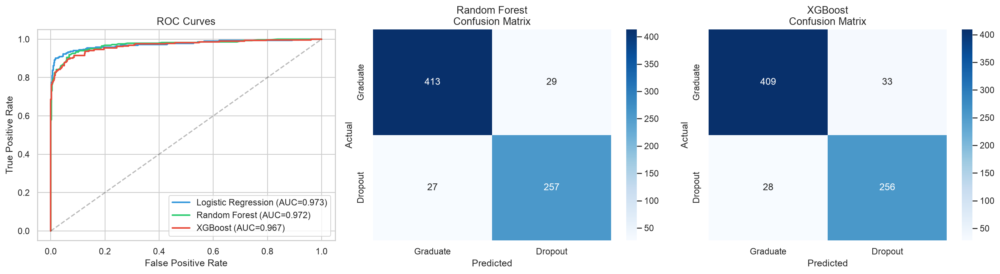

# Student Dropout Prediction

[](https://student-dropout-prediction-mianiela22.streamlit.app)

Predicting which university students are at risk of dropping out using machine learning, so institutions can intervene early and improve retention.

## The Problem

Student dropout is one of the most pressing challenges in higher education. Roughly 30% of first-year students at US institutions don't return for their second year, costing billions in lost tuition and unrealized potential. If universities could identify at-risk students early — based on enrollment data, academic performance, and socioeconomic factors — they could target advising and support resources where they matter most.

## Dataset

The [UCI Predict Students' Dropout and Academic Success](https://archive.ics.uci.edu/dataset/697/predict+students+dropout+and+academic+success) dataset contains **4,424 student records** with **36 features** spanning:

- **Demographics**: age, gender, marital status, nationality
- **Academic background**: previous qualifications, admission grade
- **Socioeconomic**: parental education and occupation, scholarship status, tuition payment
- **Academic performance**: curricular units enrolled, approved, and grades for semesters 1–2
- **Macroeconomic context**: unemployment rate, inflation, GDP at time of enrollment

**Target**: three-class (Dropout / Enrolled / Graduate), simplified to binary (Dropout vs. Graduate) for modeling.

## Approach

1. **Exploratory Data Analysis** — understanding feature distributions, class imbalance, and which variables correlate with dropout
2. **Preprocessing** — feature scaling, encoding, and handling the ~39/61 class split
3. **Modeling** — comparing Logistic Regression, Random Forest, and XGBoost with proper cross-validation
4. **Evaluation** — precision, recall, F1, AUC-ROC (not just accuracy), plus a confusion matrix
5. **Interpretability** — SHAP values to explain which factors drive dropout risk
6. **Business framing** — translating model output into actionable recommendations for an advising team

## Results

All three models achieve strong performance (AUC > 0.96), with **Logistic Regression** slightly outperforming the ensemble methods — evidence that the relationship between features and dropout is largely linear.

| Model | Accuracy | F1 (Dropout) | AUC-ROC | Recall | Precision |
|-------|----------|-------------|---------|--------|-----------|
| **Logistic Regression** | 0.926 | 0.908 | **0.973** | **0.937** | 0.881 |
| Random Forest | 0.923 | 0.902 | 0.972 | 0.905 | 0.899 |
| XGBoost | 0.916 | 0.894 | 0.967 | 0.901 | 0.886 |

**Key finding:** The model catches **94% of at-risk students** (recall), meaning for a cohort of 1,000 students, it would correctly flag ~366 of the ~390 who would otherwise drop out — early enough for an advising team to intervene.

### Top Predictors of Dropout (via SHAP)

| Feature | Direction |
|---------|-----------|
| Curricular units approved (sem 1 & 2) | Fewer approved → higher dropout risk |
| Tuition fees up to date | Not current → higher dropout risk |
| Curricular units enrolled (sem 2) | Fewer enrolled → higher dropout risk |
| Scholarship holder | No scholarship → higher dropout risk |
| Semester grades | Lower grades → higher dropout risk |

The strongest signals are **first-semester academic performance** and **financial standing** — both actionable intervention points for universities.

<p align="center">
  
</p>

## Interactive Demo

A Streamlit app lets you input a student's profile and get a real-time dropout risk prediction with explanations.

```bash
streamlit run app.py
```

## Project Structure

```
student-dropout-prediction/
├── app.py              # Streamlit demo app
├── data/               # Dataset (CSV)
├── notebooks/          # Jupyter notebooks (EDA, modeling)
├── src/                # Reusable Python modules
├── figures/            # Saved visualizations
├── requirements.txt    # Python dependencies
└── README.md
```

## Setup

```bash
python -m venv venv
source venv/bin/activate
pip install -r requirements.txt

# Run notebooks
jupyter notebook

# Run the interactive demo
streamlit run app.py
```

## Author

**Mirla Irias** — Data Science & Mathematics, University of Miami | M.S. Data Science, Rice University (incoming)

- GitHub: [@mianiela22](https://github.com/mianiela22)
